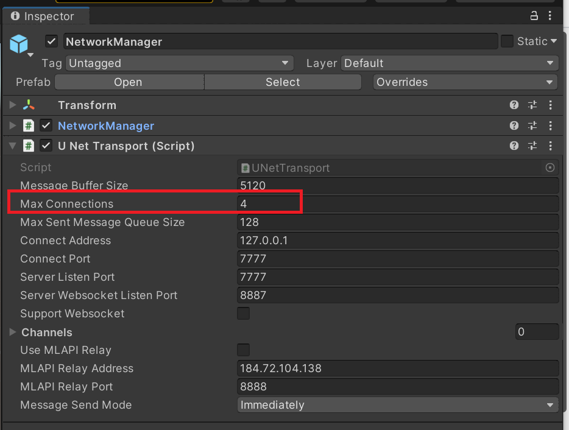
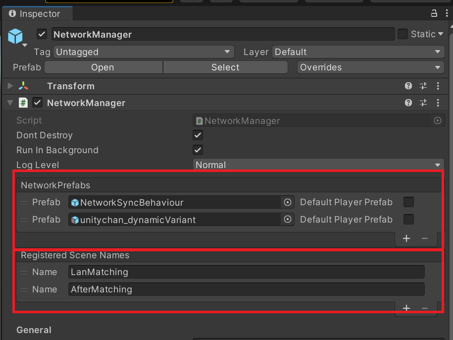
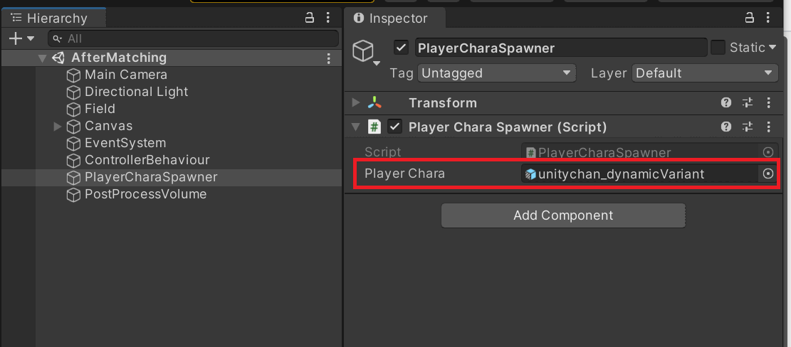

# サンプルプロジェクトについて
  

## 接続後の大まかな流れ
### プレイヤー名の同期について
<pre>
1.ホストとして立ち上げたアプリは、ユーザー名を同期するためのネットワークオブジェクト「NetworkSyncBehaviour」を生成します。
2.クライアントが接続した際には、「NetworkSyncBehaviour」が生成されます。
3.接続時にServerRPCを呼び出して、ユーザー名をホストに伝えます。
4.クライアントで「NetworkSyncBehaviour」生成したときに、MLAPIのServerRPCによって他ユーザー名のリクエストを出します。
5.ホストは現在もっているユーザー数分だけClientRPC呼び出しをしてクライアントにユーザー名情報を伝えます。

このように NetworkSyncBehaviourのRPCによってユーザー名の同期をおこなっています。
</pre>

### 開始の流れ
<pre>
1.Hostが開始ボタンを押すと、NetworkManagerを介して全ユーザーに対してシーン遷移を促します。
2.実際のシーンに遷移後、ホスト側で「PlayerCharaSpawner」が全ユーザーの操作するネットワークオブジェクトを生成します。
</pre>

## 設定回りについて

### ルームの最大人数について

  
ルームの設定はNetworkManagerのUNetTransportにあるMaxConnectionを取得して設定しています。

## シーン遷移やネットワーク同期について

  
NetworkPrefabsでネットワーク上で同期したいオブジェクトを設定します。 
このPrefabにはNetworkObjectがついている必要があります。 
 
またNetwork越しにシーン遷移するので、Registred Scene Namesも設定します。

## 遷移後に操作するキャラクターについて
  
シーン遷移後に操作するキャラは、PlayerCharaSpawnerに設定されたPrefabが生成されます。 
この時生成するPrefabは先のNetworkManagerにNetworkPrefabsとして登録しておく必要があるので注意が必要です。

## その他情報
毎回、ルームを立ててデバッグをするのが大変なので、Editorで開発している時に、AfterMatchingシーンを直接起動しても良いようにしています。
PlayerCharaSpawnerでEditorのみの起動があり、ソチラでやっています。
ここではPrefabファイルが置いてあるパスに依存する作りになっていますので、ご注意ください。

