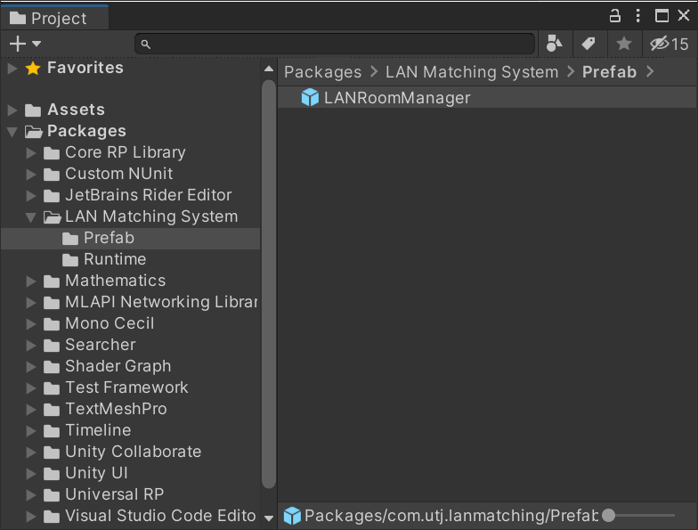
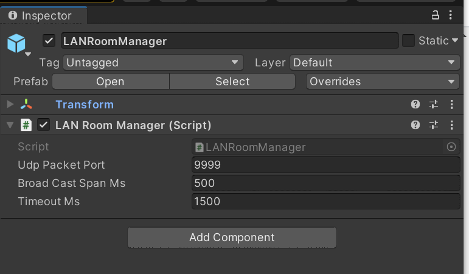

# UnityLANMatching
UnityのLANのマッチング

## Packageで提供している機能について
Packageフォルダにあるパッケージでは、「ルームを立てる」「ルームを探す」の二種類の機能があります。<br />
ルームへの接続後については、全くケアしていません <br />
（サンプルではMLAPIでプレイヤー名の同期などを行っています）<br >
<br />
Broadcastアドレス(255.255.255.255)に対して、UDPパケットでルーム情報を流すことでLAN内でのマッチングを実現しています。


### LANマッチングのセットアップについて
 <br />
シーン上にPackage内にあるLANRoomManager.prefabを配置してください。

### Prefab設定
 <br />
Inspector上でいくつかの項目が設定できます <br />
■UdpPacketPort<br/>
Broadcast(255.255.255.255)へルーム情報を流す時のポート番号を指定します<br />
■BroadCastSpanMs<br/>
何ミリ秒ごとに情報を流すか設定します。<br />
■TimeoutMs<br/>
何ミリ秒の間データを受信しなかったらタイムアウトとみなすか、設定します。<br />

### ルームを立てる時の処理
```
byte limitUser = 16; // <- 最大参加人数
int serverPort = 8888; // <- 実際のサーバー接続時に待っているポート番号
var roomInfo = new RoomInfo( "初心者歓迎ルーム", serverPort , limitUser);
// Hostルームの設定をします
LANRoomManager.Instance.hostRoomInfo = roomInfo;
// 募集を開始します
LANRoomManager.Instance.StartHostThread();
```

その後適宜ルームの参加人数を下記のような呼び出しで更新してください

### ルームを探すときの処理
```
// コールバックの指定
LANRoomManager.Instance.OnFindNewRoom = (hostRoomInfo)=>{
  Debug.Log("新規ルームが見つかりました："+hostRoomInfo.ToString());
};
LANRoomManager.Instance.OnChangeRoom = = (hostRoomInfo)=>{
  Debug.Log("情報が変更されました:"+hostRoomInfo.ToString());
};
LANRoomManager.Instance.OnLoseRoom = = (hostRoomInfo)=>{
  Debug.Log("ルームが閉じました:"+hostRoomInfo.ToString());
};

// ルーム検索を開始します
LANRoomManager.Instance.StartClientThread();
```


### ルームの検索、及びルームの募集を停止する時の処理
```
LANRoomManager.Instance.OnFindNewRoom = null;
LANRoomManager.Instance.OnChangeRoom = null;
LANRoomManager.Instance.OnLoseRoom = null;
LANRoomManager.Instance.Stop();
```


### 仕様上の問題
・仮想マシンなどがセットアップされた環境では、ルームを立てた際にその情報がLANではなく 仮想ネットワーク環境に流れてしまうことがあります<br />
・1つのマシンで複数のルームを立てることは出来ません。（MLAPIのホストPortが専有されるためです)<br />
・1つのマシンでは、複数の実行ファイルで「ルームを探す」が同時に行えません。実行中の「ルームを探す」のタスクが完了すると、別の実行ファイルで処理されます<br />

## サンプルプロジェクトについて
サンプルでは、下記のようにキャラクターの位置が同期するデモになっています<br />
### ローカルPCでの動作
 <br />
### 複数台での動作
 <br />

<br />
ルームが見つかったら接続はMLAPIで行っています。<br />

サンプルプロジェクトの解説等については、別途ドキュメントにしました<br />
[こちらのドキュメント](AboutSampleProject.md)をご参照ください<br />
